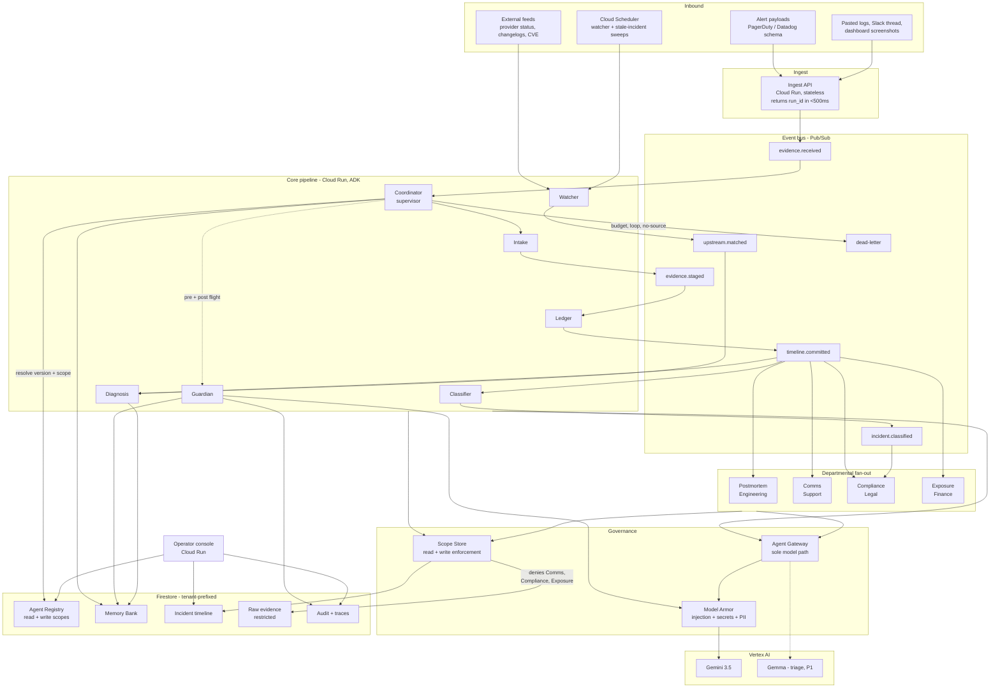
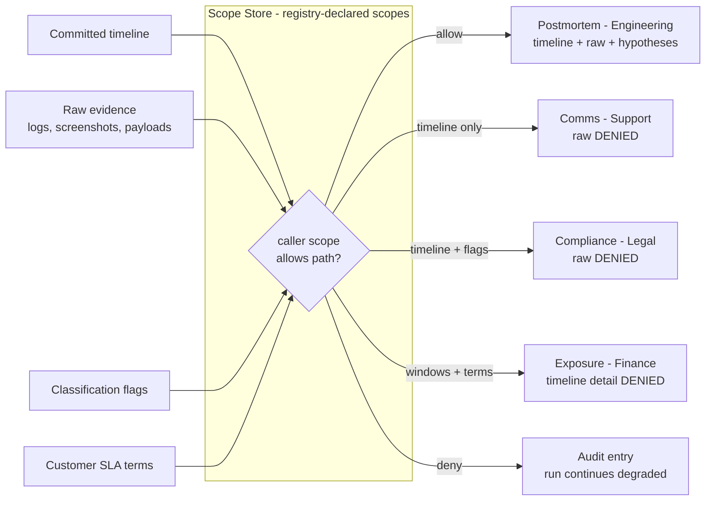
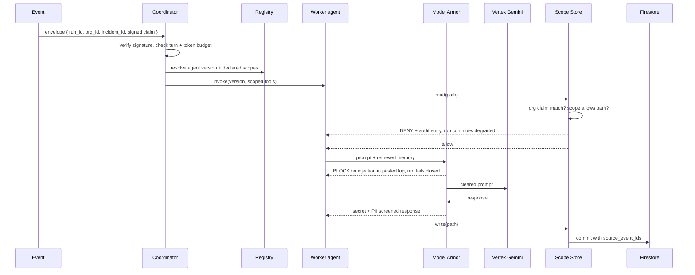
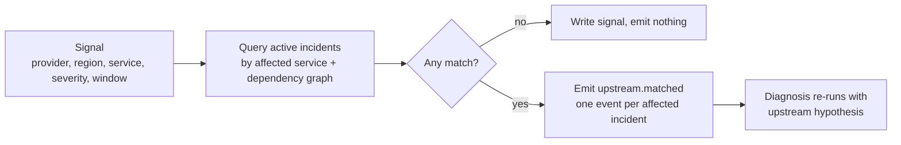

# Postmortem Architecture

Derived from `SPEC-postmortem.md`.

## 1. System overview



## 2. The scope boundary (this is the differentiator)

One committed timeline, four departments, four different read scopes. Enforcement lives in `data/scope_store.py`, never in a prompt.



**Why this matters and must be said out loud in the video:** a scope expressed as a prompt instruction is a suggestion. A scope expressed as a store-layer check is a boundary. Support's agent is *structurally incapable* of reading a log line that might contain a customer's data, not merely instructed to avoid it.

## 3. Trust boundary and identity



**Rules the code enforces, not merely documents**

1. No agent imports the Vertex SDK. Only `gateway/` does. Import lint check in CI.
2. Every Firestore access goes through `data/scope_store.py`. Direct client use anywhere else fails CI.
3. Every timeline entry and hypothesis carries `source_event_ids[]`. Commits without one are rejected at the store layer, not the agent layer.
4. Service account per agent role. Only Ledger writes `timeline`. Watcher writes only `signals` and can never read incident content.
5. Read denials are logged and non-fatal. The run continues at reduced context rather than failing, because a Support draft without logs is the correct outcome, not an error.

## 4. The Watcher, correlated not broadcast



Judges look for the negative case. The demo must show the two unaffected incidents staying untouched.

## 5. Failure tolerance

| Failure | Detection | Response |
|---|---|---|
| Worker loops | Same tool-call signature three times in one run | Terminate, quarantine agent version, alert |
| Runaway cost | Turn or token budget exceeded | Terminate, quarantine, alert |
| Hallucinated root cause | Commit missing `source_event_ids` | Store-layer rejection, run to dead-letter |
| Schema drift | Pydantic validation on every agent output | Reject to dead-letter, never coerce |
| Transient Vertex error | Exception class | Backoff with jitter, three attempts, then dead-letter |
| Prompt injection in a pasted log line | Model Armor input verdict | Fail closed, audit entry, no tool execution |
| Secret leaked into a draft | Model Armor output verdict | Redact, audit, flag the draft |
| Out-of-scope read attempt | Scope Store check | Deny, audit, run continues degraded |
| Forged org claim | Identity path check | Deny, audit, run marked `denied` |
| Container death mid-run | Pub/Sub ack deadline | Redelivery; runs idempotent on `run_id` |
| Duplicate evidence submission | Idempotency key `run_id` + `event_id` | Second write is a no-op |

## 6. Data model (Firestore)

All paths tenant-prefixed under `/tenants/{org_id}`.

```
/tenants/{org_id}
  /services/{service_id}          name, owner_team, depends_on[], criticality
  /customers/{customer_id}        name, sla_terms{uptime_target, credit_rate}, data_region
  /incidents/{incident_id}        opened_at, resolved_at, status, severity,
                                  services_affected[], alert_source
  /raw_evidence/{event_id}        RESTRICTED. incident_ref, kind(alert|log|screenshot|slack),
                                  payload, media_uri, received_at
  /events/{event_id}              incident_ref, status(staged|committed|rejected),
                                  confidence, extracted{}, ts, source_ref
  /timeline/{incident_id}         entries[{ts, actor, action, evidence, source_event_ids[]}],
                                  downtime_windows[], last_updated
  /hypotheses/{hypothesis_id}     incident_ref, statement, confidence,
                                  source_event_ids[], prior_incident_refs[]
  /classification/{incident_id}   severity, services[], downtime_windows[],
                                  data_touched(bool), data_categories[], classified_at
  /drafts/{draft_id}              incident_ref, department(eng|support|legal|finance),
                                  kind(postmortem|status_update|gdpr_assessment|sla_exposure),
                                  status(draft|approved|rejected), body, source_refs[]
  /clocks/{incident_id}           gdpr_started_at, deadline_at, status
  /signals/{signal_id}            source, provider, region, service, severity, window, seen_at
  /memory/{key}                   incident signatures, service ownership, failure patterns,
                                  customer terms, open_clarifications[]
  /alerts/{alert_id}              type(classified|blocked|denied|quarantine), severity, payload
  /audit/{entry_id}               actor_agent, version, verdict(allow|deny|block|redact),
                                  reason, path, run_id, ts
  /runs/{run_id}                  status, turns_used, tokens_used, span_id, agents_invoked[]

/registry/{agent_name}/versions/{semver}
   input_schema, output_schema, allowed_tools[], read_scopes[], write_scopes[],
   department, status, published_at
```

`raw_evidence` is a separate collection precisely so the scope check is a path check. Registry is global, not tenant-scoped: that is the point of cross-department and cross-org reuse.

## 7. Repository layout

```
mortemtrace/
  LICENSE                     MIT, detectable at root
  README.md                   spin-up instructions, disclosure, data sources
  ARCHITECTURE.md             this file
  docs/architecture.mermaid
  agents/
    coordinator/              supervisor, routing, budgets, quarantine
    watcher/                  external feeds, incident correlation
    intake/                   multimodal evidence extraction
    ledger/                   reconciliation, sole writer of timeline
    diagnosis/                hypotheses with cited evidence
    classifier/               severity, downtime, data-touched flag
    guardian/                 policy, escalation, audit
    departments/
      postmortem/             Engineering
      comms/                  Support
      compliance/             Legal, GDPR Art. 33
      exposure/               Finance, SLA credits
  gateway/                    sole Vertex path, Model Armor both directions
  data/scope_store.py         sole Firestore path, org claim + scope enforcement
  registry/                   publish, resolve, deprecate, scope declaration
  memory/                     Memory Bank read and write, scoped retrieval
  telemetry/                  OTel setup, span helpers
  api/                        ingest endpoint
  console/                    operator UI
  infra/                      gcloud deploy scripts, topics, indexes
  seed/                       synthetic incidents, alerts, logs, screenshots, signals
  tests/                      schema, idempotency, org isolation, scope denial,
                              injection, watcher correlation
```

## 8. Explicit trade-offs

- **Firestore over Cloud SQL.** Serverless, nothing to keep warm inside a free trial, natural tenant path prefixes, and separating `raw_evidence` into its own collection makes the scope boundary a path check rather than a column filter. Cost: weak ad-hoc aggregates, accepted because exposure figures are computed and written.
- **Pub/Sub over direct agent-to-agent calls.** Decoupling and redelivery are directly scored. The fan-out is one topic and four independent subscribers, which is exactly why adding a fifth department costs nothing. Cost: harder local dev, mitigated with the emulator in `infra/`.
- **Supervisor over a flat mesh.** One place for budgets, loop detection, quarantine. Cost: single point of logic, mitigated by keeping the Coordinator thin. It routes and enforces; it never reasons about incidents.
- **Drafts, never execution.** No auto-remediation, no auto-publish, no regulator notification. In this domain autonomous action is the first thing a judge will attack, and "a human approves every output" is the correct answer.
- **Read denials degrade rather than fail.** A Support draft without log access is the intended outcome, not an error state. Failing the run there would be wrong.
- **Fail closed on injection and forged claims.** Produce nothing rather than something unverified.
- **Synthetic seed data on real public schemas.** PagerDuty and Datadog payload formats are public; public postmortem archives give real structure. Stated honestly in the video and the data sources field.

## 9. What I would revisit at real scale

- Memory Bank retrieval moves to vector search once incident history outgrows structured signatures.
- Ledger is the bottleneck as sole writer. Shard by incident, keep the single-writer invariant per shard.
- Model Armor on every call is expensive at volume. Route low-severity alerts through Gemma triage first and reserve full screening for pasted content and external feeds.
- Registry needs an approval workflow and signed agent artefacts before a new department can self-publish in production.
- The dependency graph driving Watcher correlation is hand-seeded here. At scale it comes from service discovery or a real CMDB.
